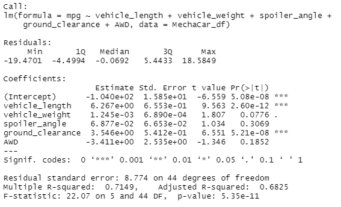
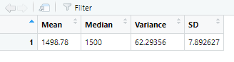
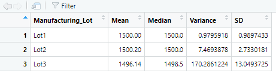
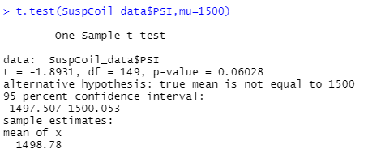
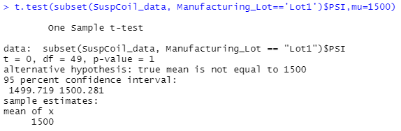
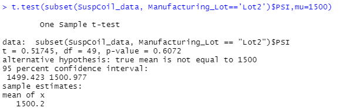
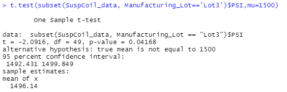

# MechaCar Statistical Analysis

## Overview

Jeremy has been working in AutosRUs for ten years and has exhaustive product knowledge and internal connections. When the company decides to upgrade the decision making process based on the data analysis, he is the natural choice for Primary Analyst in Data Analytics team. The data analysis team is responsible for performing retrospective analysis of historical data, analytical verification and validation of current automotive specifications, study design of future product testing. AutosRUs Executive team realizes that data analysis for decision making is a must for successful auto launches. 

AutosRUs’ newest prototype, the MechaCar, is suffering from production troubles. AutosRUs’ upper management has called on Jeremy and the data analytics team to review the production data for insights that may help the manufacturing team. Given below are some of the analysis performed.

**Data Sources:** [MechaCar_mpg.csv](./Resources/MechaCar_mpg.csv), [Suspension_Coil.csv](./Resources/Suspension_Coil.csv)

**Programming Languages Used:** R

**Softwares Used:** RStudio, VSCode

## Linear Regression to Predict MPG

Vehicle Length *(vehicle_length)* and Ground Clearance *(ground_clearance)* provide a non-random variance to the *mpg* values in the dataset as their Pr(>|t|) values are very small. I.e., 2.60e-12 and 5.21e-08. Hence, these two variables have very low probability of contributing a random amount of variance. In other words Vehicle Length and Ground Clearance have significant impact on mpg of the vehicle. Also, the Vehicle Weight (vehicle_weight) has Pr(>|t|) of 0.076 which is close to 0.05.  Therefore, Vehicle Weight can also provide some non-random variance but the impact is not as significant as above mentioned variables.

The *p*-value of linear regression analysis is 5.35e-11 which is much lower than out assumed significance level of 0.05. Therefore, there is enough evidence to reject the null hypothesis which state that "The slope of the linear model is zero, or m = 0". This means the slope of linear model is not zero.  

Since the *r-squared (r2) value* (aka coefficient of determination) for the linear regression is 0.7149, it shows that there is high likelihood that future data points will fit the linear model. In other words, this linear model does predict mpg of MechaCar prototypes effectively.

## Summary Statistics on Suspension Coils

### Total Summary

### Lot Summary

The variance for all lots combined is 62.29 which is within the 100 pounds per square inch limit specified in the design specification. However, looking at the variance for individual lots, the variance for *Lot3* is 170.28. This is more than the maximum variance of 100 psi specified in the design specification. 

Therefore, the current manufacturing data meet this design specification for all manufacturing lots in total. However, considering all lots individually, Lot3 does not meet the design specification.    

## T-Tests on Suspension Coils

1. When running a T-Test (t.test() function) for determining if PSI across all manufacturing lots with the statistically different from the population mean of 1,500 PSI, we get p-value of 0.06028 and t-value of -1.8931. Since p-value is close to significance value of 0.05, we can assume that we have enough evidence to reject the null hypothesis. *This means that there is a statistical difference between the PSI across all manufacturing lots and the population mean of 1500. Although the difference is not large.* The relatively large t-value also supports this conclusion.

    

2. When running a T-Test for determining if mean PSI for **Lot1** is statistically different from the population mean of 1,500 PSI, we get p-value of 1 and t-value of 0. *This means that mean of PSI for Lot1 is exactly the same as the population mean of 1500.*

    

3. When performing a T-Test for determining if mean PSI for **Lot2** is statistically different from the population mean of 1,500 PSI, we get p-value of 0.6072 and t-value of 0.51745. Since p-value is greater than significance value of 0.05, we don't have enough evidence to reject the null hypothesis. *This means that there is no statistical difference between the mean of PSI for Lot2 and the population mean of 1500.* The relatively small t-value also supports this conclusion.

    

4. When performing a T-Test for determining if mean PSI for **Lot3** is statistically different from the population mean of 1,500 PSI, we get p-value of -2.0916 and t-value of 0.04168. Since p-value is less than significance value of 0.05, we have enough evidence to reject the null hypothesis. *This means that there is a statistical difference between the mean of PSI for Lot2 and the population mean of 1500.* The large t-value also supports this conclusion.

    

## Study Design: MechaCar vs Competition

In this study, we will try to quantify how MechaCar performs against its competitors by analyzing various metrics which will of interest for our potential customers. We are assuming that MechaCar's primary customer segment are suburban families. Therefore, we will test the following metrics in this analysis:

* Cost
* Highway Fuel Efficiency
* Seating Capacity
* Boot Space
* Safety Rating
* Maintenance Cost

### Test 1:

In this test, we are going to analyze the **Highway Fuel Efficiency** of MechaCar and its competitors. Since fuel efficiency among same vehicle class is not expected to be too much different in controlled environment, we would like to compare all competitors at once to look at a bigger picture before deciding if we want to do any further analysis. 

    Null Hypothesis (Ho): The mean of Highway Fuel Efficiency for MechaCar and all other competitors are same.

    Alternate Hypothesis (Ha): The mean of Highway Fuel Efficiency for either MechaCar or for at least one other competitor is different from rest of the group.

We will use **ANOVA** test to see if there is a staistical difference between mean distribution of Highway Fuel Efficiency for MechaCar and mean distribution of Highway Fuel Efficiency for competitors.

We will need the datasets from different competitors with Highway Fuel Efficiency data included. We will have to include all the observations into one data frame for aov().    

### Test 2:

In this test, we are going to analyze the **Maintainance Cost** of MechaCar and its competitors. Since Maintenance Cost can vary widely and depends on a number of factors, we will compare with each competitor individually.  

    Null Hypothesis (Ho): There is no statistical difference between Maintenance Cost for MechaCar and its competitor.

    Alternate Hypothesis (Ha): There is a statistical difference between Maintenance Cost for MechaCar and its competitor.

We will use **Two-Sampe t-Test** to see if there is a staistical difference between distribution mean of Maintenance Cost for MechaCar and distribution mean of Maintenance Cost for the competitor.

We will need the datasets from different competitors with Maintenance Cost data included.